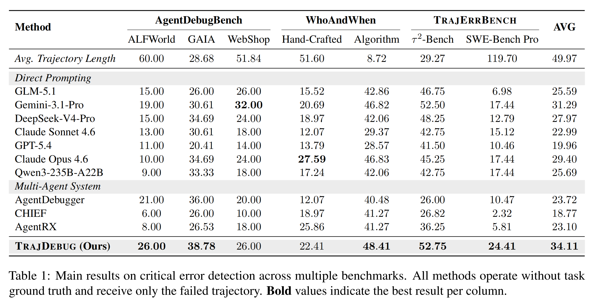

# TRAJDEBUG

> [English](README.md)

**TRAJDEBUG：通过追踪错误生命周期定位长程 Agent 轨迹中的关键失败**，是一个基于证据的关键错误定位框架。本仓库提供 detector、统一数据适配器、评测工具与本地 viewer。

## 方法

TRAJDEBUG 先构建多粒度轨迹视图，再执行三个可审计阶段：

1. **错误触发检测：**识别错误承诺，并要求逐字引用错误内容与被违反的参照。
2. **错误状态分类：**按被违反对象聚合 trigger，判断错误是否修复及其终态影响。
3. **因果归因：**从与终态相关的候选中选择对失败负责的起源步。


实现细节见 [`detector/README_zh.md`](detector/README_zh.md)，论文见 [`main.pdf`](main.pdf)。

## 结果



## 安装

推荐 Python 3.10+。

```bash
python -m venv .venv
source .venv/bin/activate
pip install -e .
# 同时安装 viewer：
pip install -e ".[viewer]"
```

将 `.env.example` 复制为 `.env`，填写端点信息并在 shell 中导出。本项目仅使用 OpenAI-compatible Chat Completions API。

## 数据

detector 输入为 `data/unified/<dataset>/` 下每条轨迹一个 JSON：

| 数据集键 | 轨迹数 |
|---|---:|
| `alfworld` | 100 |
| `gaia` | 50 |
| `webshop` | 50 |
| `whoandwhen` | 58 |
| `whoandwhen_algorithm` | 126 |
| `tau2bench` | 400 |
| `swebenchpro` | 86 |

其中 400 条 τ²-Bench 与 86 条 SWE-Bench Pro 失败轨迹组成 TRAJERRBENCH。构建已注册数据集：

```bash
python -m data_processing.build_unified_dataset --all
```

统一 schema 与自定义适配器说明见 [`data_processing/README_zh.md`](data_processing/README_zh.md)，数据许可与归属说明见 [`data/README.md`](data/README.md)。

## OpenAI-compatible API

```bash
export OPENAI_API_KEY="..."
export OPENAI_BASE_URL="https://api.openai.com/v1"
export DETECTOR_MODEL="your-model-name"
```

也可用 `DETECTOR_API_KEY`、`DETECTOR_BASE_URL` 覆盖对应的 `OPENAI_*` 变量。

## 使用 SGLang 自部署

单独安装 SGLang 后，启动一个 OpenAI-compatible 服务：

```bash
MODEL_PATH=/models/your-model \
SERVED_MODEL_NAME=your-model \
TP_SIZE=8 \
bash deploy_qwen_router.sh
```

默认端点为 `http://127.0.0.1:30000/v1`。

使用该端点运行 detector：

```bash
DETECTOR_BASE_URL=http://127.0.0.1:30000/v1 \
DETECTOR_API_KEY=EMPTY \
DETECTOR_MODEL=your-model \
bash run_pipeline.sh
```

## 运行

```bash
DETECTOR_MODEL=your-model bash run_pipeline.sh

DATASETS="tau2bench swebenchpo" \
FILE_CONCURRENCY=2 \
LLM_CONCURRENCY=8 \
DETECTOR_MODEL=your-model \
bash run_pipeline.sh
```

输入默认位于 `data/unified`，输出默认位于 `outputs`。每个数据集会生成 `<dataset>_stage_a`、`<dataset>_stage_b`、`<dataset>_phase1`、`<dataset>_phase2`、`<dataset>_final` 与 `score_<dataset>.json`。目录结构、推荐阅读顺序及每个论文数据集 10 条采样示例见 [`outputs/README.md`](outputs/README.md)。

## 评测

`run_pipeline.sh` 会自动执行严格步匹配评测。也可单独评分：

```bash
python detector/score_steps.py \
  --unified-dir data/unified/alfworld \
  --pred-dir outputs/alfworld_final \
  --out outputs/score_alfworld.json
```

## 生成反馈

可以根据定位出的 critical error step 生成可操作的反馈，用于提升 Agent 的自我修复与失败记忆迁移能力（详见论文 Section 6）：

```bash
python applications/generate_feedback.py \
  --final_dir outputs/alfworld_final \
  --trajectory_dir data/unified/alfworld \
  --stage_a_dir outputs/alfworld_stage_a \
  --output_dir outputs/alfworld_report \
  --base_url "$OPENAI_BASE_URL" \
  --model "$DETECTOR_MODEL" \
  --api_key "$OPENAI_API_KEY" \
  --resume
```

生成的 feedback 位于 `outputs/<dataset>_report/<task_id>_report.json` 的 `fix_suggestion.hint_sentence` 字段。

## Viewer

```bash
python -m viewer.server --dataset alfworld --output-dir outputs
```

浏览器打开 <http://localhost:8000>。详见 [`viewer/README.md`](viewer/README.md)。

## 引用

如果本项目对您的研究有帮助，请引用论文。作者与仓库元数据见 [`CITATION.cff`](CITATION.cff)。

## 许可证

代码采用 [MIT License](LICENSE)。各数据集组件仍受其原始许可证与使用条款约束。
